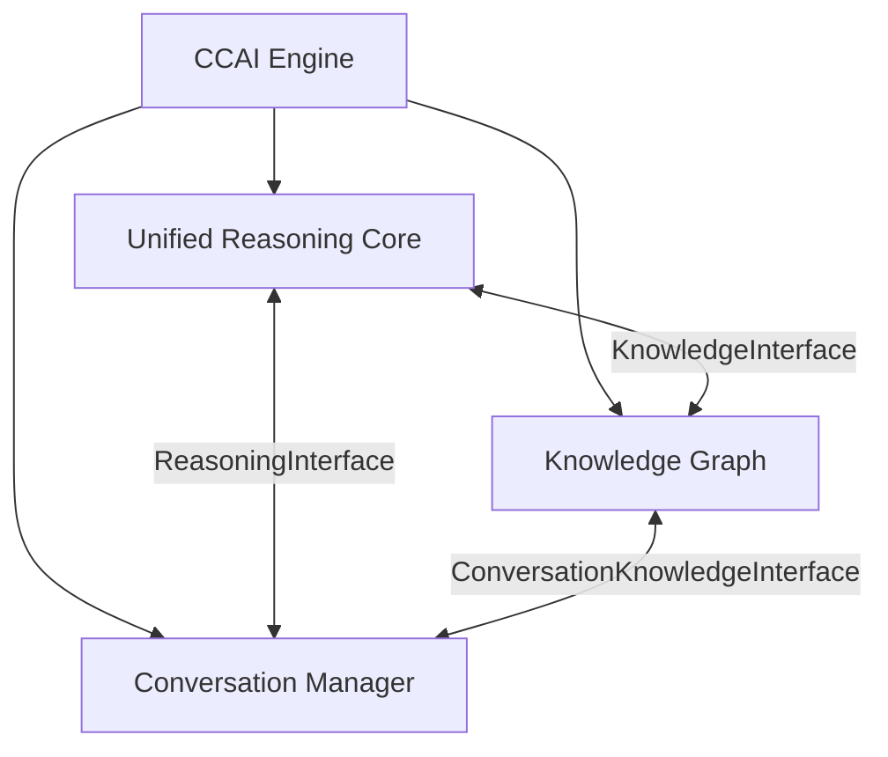
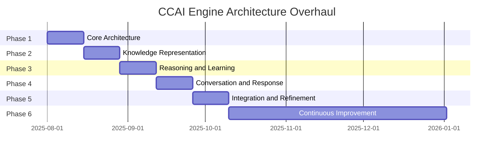

# CCAI Engine Architecture Overhaul
## A Truly Intelligent System

---

## Agenda

1. Current Architecture Issues
2. New Architecture Overview
3. Key Components
4. Benefits
5. Implementation Plan
6. Timeline
7. Next Steps

---

## Current Architecture Issues

- **Hardcoded Patterns**: Too reliant on predefined patterns and templates
- **Limited Learning**: Cannot truly learn from experience
- **Rigid Knowledge**: Cannot handle ambiguity or uncertainty
- **Template Responses**: Responses lack natural variation
- **Complex Structure**: Too many specialized components
- **Limited Context**: Cannot maintain conversation context effectively
- **Difficult Maintenance**: Hard to extend and maintain

---

## New Architecture Overview

A simplified, powerful architecture with three core components:

---

## Key Components

### Unified Reasoning Core

- **Ideom-Based Cognition**: Atomic units of cognition form the basis of reasoning
- **Signal Propagation**: Signals activate related concepts
- **Prefab Activation**: Patterns trigger higher-level concepts
- **Dynamic Learning**: Continuously learns from experience

### Knowledge Graph

- **Flexible Knowledge Representation**: Graph-based knowledge structure
- **Uncertainty Handling**: Represents and reasons with uncertain knowledge
- **Self-Organizing Structure**: Reorganizes based on new knowledge
- **Semantic Similarity**: Finds similar concepts

### Conversation Manager

- **Context-Aware Conversations**: Maintains context across interactions
- **Intent Recognition**: Understands user intent
- **Response Planning**: Plans appropriate responses
- **Dynamic Response Generation**: Generates natural responses

---

## Benefits

- **Improved Intelligence**: More human-like reasoning and learning
- **Enhanced Adaptability**: Adapts to new domains without reprogramming
- **Better Conversations**: More coherent and context-aware interactions
- **More Natural Responses**: Varied and natural language generation
- **Continuous Learning**: Improves over time with experience
- **Simplified Maintenance**: Easier to extend and maintain
- **Reduced Development Time**: Faster feature development

---

## Implementation Plan

### Phase 1: Core Architecture (Weeks 1-2)
- Basic component structure
- Core data structures
- Integration interfaces
- Basic functionality

### Phase 2: Knowledge Representation (Weeks 3-4)
- Uncertainty handling
- Semantic similarity
- Self-organizing structure
- Knowledge extraction and learning

### Phase 3: Reasoning and Learning (Weeks 5-6)
- Enhanced signal propagation
- Prefab system
- Reasoning engine
- Learning mechanisms

### Phase 4: Conversation and Response (Weeks 7-8)
- Context tracking
- Intent recognition
- Memory management
- Dynamic response generation

### Phase 5: Integration and Refinement (Weeks 9-10)
- Full integration
- Advanced features
- User interface
- Testing and refinement

### Phase 6: Continuous Improvement (Ongoing)
- Performance monitoring
- User feedback
- Continuous enhancements
- Knowledge expansion

---

## Timeline

---

## Resource Requirements

### Development Team
- 1 Senior AI Architect (full-time)
- 2 AI/ML Engineers (full-time)
- 1 NLP Specialist (full-time)
- 1 Full-stack Developer (full-time)
- 1 UX Designer (part-time)

### Infrastructure
- Development Environment
- Production Environment
- Monitoring and Logging

---

## Success Metrics

### Technical Metrics
- **Response Time**: < 1s for simple queries, < 3s for complex queries
- **Accuracy**: > 90% for factual queries
- **Learning Rate**: Demonstrable improvement after learning

### User Experience Metrics
- **User Satisfaction**: > 4/5 average rating
- **Conversation Length**: Average of 5+ turns per conversation
- **Return Rate**: > 70% of users return within a week

---

## Risk Management

### Potential Risks
- **Technical Complexity**: System may be too complex to implement within timeline
- **Performance Issues**: System may be too slow for real-time conversation
- **Knowledge Limitations**: System may not have enough knowledge to be useful
- **User Adoption**: Users may not find the system intuitive or useful

### Mitigation Strategies
- Start with minimal viable product and incrementally add features
- Implement performance optimizations and caching
- Integrate with external knowledge sources
- Conduct user testing throughout development

---

## Next Steps

1. **Finalize Architecture Design**: Review and approve the architecture design
2. **Allocate Resources**: Assign team members and set up infrastructure
3. **Begin Implementation**: Start with Phase 1 (Core Architecture)
4. **Set Up Monitoring**: Establish metrics and monitoring
5. **Create Feedback Loop**: Set up mechanisms for gathering user feedback

---

## Questions?

Thank you for your attention!

For more details, please refer to:
- Architecture Overview Document
- Technical Specification
- Implementation Roadmap
- Component Design Documents