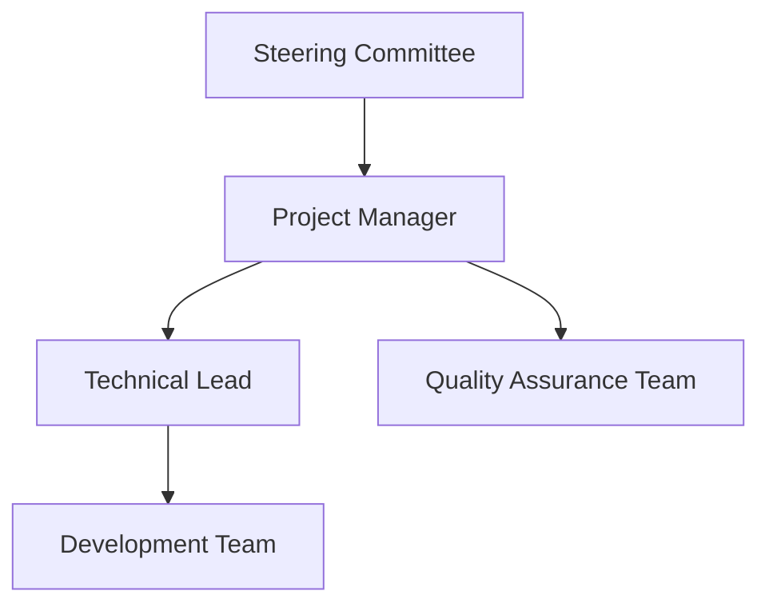
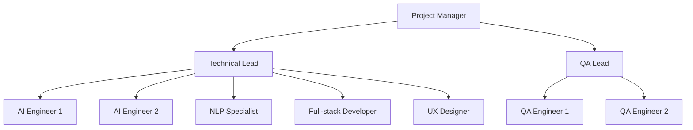
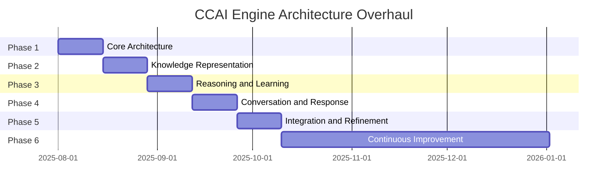

# Project Management Plan for CCAI Engine Architecture Overhaul

This document outlines the comprehensive project management plan for the CCAI Engine architecture overhaul. It provides a detailed plan for managing the project, including project governance, communication plan, risk management, resource allocation, change management, quality management, project schedule, and project budget.

## 1. Project Governance

### 1.1 Project Organization

The project will be organized with the following structure:

### 1.2 Roles and Responsibilities

#### Steering Committee
- Provide strategic direction for the project
- Approve major project decisions and changes
- Ensure alignment with organizational goals
- Allocate resources and budget
- Review project progress and status

#### Project Manager
- Overall responsibility for project delivery
- Develop and maintain project plan
- Coordinate project activities
- Manage project resources
- Track project progress
- Report to steering committee
- Manage risks and issues
- Ensure quality standards are met

#### Technical Lead
- Provide technical leadership and guidance
- Make technical decisions
- Review and approve technical designs
- Ensure technical quality
- Mentor development team
- Coordinate with other technical teams

#### Development Team
- Implement the architecture overhaul
- Develop code according to specifications
- Perform unit testing
- Fix defects
- Participate in code reviews
- Document code and technical decisions

#### Quality Assurance Team
- Develop and execute test plans
- Perform testing at all levels
- Report defects and issues
- Verify fixes
- Ensure quality standards are met
- Provide feedback on quality

### 1.3 Decision-Making Process

The decision-making process will follow these steps:

1. **Technical Decisions**:
   - Technical decisions will be made by the Technical Lead
   - Major technical decisions will be reviewed by the Project Manager
   - Critical technical decisions will be escalated to the Steering Committee

2. **Project Decisions**:
   - Project decisions will be made by the Project Manager
   - Major project decisions will be reviewed by the Steering Committee
   - Critical project decisions will be made by the Steering Committee

3. **Decision Documentation**:
   - All decisions will be documented in the project decision log
   - Decision rationale will be recorded
   - Impact of decisions will be assessed and documented

### 1.4 Governance Meetings

The following governance meetings will be held:

1. **Steering Committee Meetings**:
   - Frequency: Monthly
   - Attendees: Steering Committee, Project Manager
   - Agenda: Project status, risks, issues, decisions, next steps

2. **Project Status Meetings**:
   - Frequency: Weekly
   - Attendees: Project Manager, Technical Lead, Team Leads
   - Agenda: Progress, plans, issues, risks, decisions

3. **Technical Review Meetings**:
   - Frequency: Bi-weekly
   - Attendees: Technical Lead, Development Team
   - Agenda: Technical design, implementation, issues, decisions

4. **Daily Stand-up Meetings**:
   - Frequency: Daily
   - Attendees: Development Team, Technical Lead
   - Agenda: Progress, plans, blockers

## 2. Communication Plan

### 2.1 Communication Matrix

| Stakeholder | Information Needs | Frequency | Method | Responsible |
|-------------|-------------------|-----------|--------|-------------|
| Steering Committee | Project status, risks, issues, decisions | Monthly | Status report, meeting | Project Manager |
| Project Manager | Detailed progress, risks, issues, changes | Weekly | Status report, meeting | Technical Lead, Team Leads |
| Technical Lead | Technical progress, issues, decisions | Daily | Stand-up, meeting | Development Team |
| Development Team | Tasks, requirements, technical decisions | Daily | Stand-up, documentation | Technical Lead |
| Quality Assurance Team | Test plans, defects, quality metrics | Weekly | Status report, meeting | QA Lead |
| End Users | Project overview, benefits, timeline | Monthly | Newsletter | Project Manager |

### 2.2 Communication Methods

The following communication methods will be used:

1. **Meetings**:
   - Face-to-face or virtual meetings
   - Scheduled in advance with agenda
   - Minutes recorded and distributed

2. **Status Reports**:
   - Written reports with standard format
   - Distributed via email or project management tool
   - Archived for reference

3. **Email**:
   - Used for formal communication
   - Clear subject lines with project identifier
   - Appropriate distribution lists

4. **Project Management Tool**:
   - Central repository for project information
   - Task tracking and assignment
   - Document sharing and collaboration

5. **Instant Messaging**:
   - Used for quick questions and informal communication
   - Not used for formal decisions or approvals
   - Appropriate channels for different topics

### 2.3 Escalation Process

The escalation process will follow these steps:

1. **Level 1: Team Member to Technical Lead**:
   - Technical issues, task-related issues
   - Response time: 24 hours

2. **Level 2: Technical Lead to Project Manager**:
   - Unresolved technical issues, resource issues, schedule issues
   - Response time: 48 hours

3. **Level 3: Project Manager to Steering Committee**:
   - Major issues affecting project success
   - Response time: 1 week

### 2.4 Reporting

The following reports will be produced:

1. **Weekly Status Report**:
   - Progress against plan
   - Accomplishments
   - Planned activities
   - Risks and issues
   - Decisions and actions

2. **Monthly Steering Committee Report**:
   - Executive summary
   - Progress against milestones
   - Budget status
   - Key risks and issues
   - Decisions required

3. **Phase-End Report**:
   - Phase accomplishments
   - Lessons learned
   - Next phase plan
   - Risks and issues
   - Recommendations

## 3. Risk Management

### 3.1 Risk Management Process

The risk management process will follow these steps:

1. **Risk Identification**:
   - Identify potential risks to the project
   - Document risks in the risk register
   - Categorize risks by type and impact area

2. **Risk Assessment**:
   - Assess probability of occurrence (High, Medium, Low)
   - Assess impact if risk occurs (High, Medium, Low)
   - Calculate risk score (Probability x Impact)

3. **Risk Response Planning**:
   - Develop response strategies for each risk
   - Assign risk owners
   - Identify triggers and contingency plans

4. **Risk Monitoring and Control**:
   - Regularly review and update risk register
   - Monitor risk triggers
   - Implement response strategies as needed
   - Report on risk status

### 3.2 Risk Register

The risk register will include the following information for each risk:

- Risk ID
- Risk description
- Risk category
- Probability
- Impact
- Risk score
- Response strategy
- Risk owner
- Triggers
- Contingency plan
- Status

### 3.3 Key Risks

The following key risks have been identified:

1. **Technical Complexity**:
   - Risk: The system may be too complex to implement within the timeline
   - Probability: Medium
   - Impact: High
   - Response: Start with a minimal viable product and incrementally add features

2. **Performance Issues**:
   - Risk: The system may be too slow for real-time conversation
   - Probability: Medium
   - Impact: High
   - Response: Implement performance optimizations and caching

3. **Knowledge Limitations**:
   - Risk: The system may not have enough knowledge to be useful
   - Probability: Medium
   - Impact: High
   - Response: Integrate with external knowledge sources

4. **User Adoption**:
   - Risk: Users may not find the system intuitive or useful
   - Probability: Medium
   - Impact: High
   - Response: Conduct user testing throughout development

5. **Resource Constraints**:
   - Risk: Required resources may not be available when needed
   - Probability: Medium
   - Impact: High
   - Response: Secure resources in advance and have backup plans

6. **Schedule Pressure**:
   - Risk: Pressure to meet deadlines may lead to reduced quality
   - Probability: High
   - Impact: Medium
   - Response: Prioritize features and use agile development practices

7. **Integration Challenges**:
   - Risk: Components may not integrate smoothly
   - Probability: Medium
   - Impact: High
   - Response: Define clear interfaces and conduct integration testing early

8. **Scope Creep**:
   - Risk: Project scope may expand beyond original boundaries
   - Probability: High
   - Impact: Medium
   - Response: Implement strict change control process

## 4. Resource Allocation

### 4.1 Team Structure

The project team will be structured as follows:

### 4.2 Resource Requirements

The following resources are required for the project:

#### Human Resources

| Role | Number | Allocation | Duration |
|------|--------|------------|----------|
| Project Manager | 1 | 100% | 10 weeks |
| Technical Lead | 1 | 100% | 10 weeks |
| AI Engineer | 2 | 100% | 10 weeks |
| NLP Specialist | 1 | 100% | 10 weeks |
| Full-stack Developer | 1 | 100% | 10 weeks |
| UX Designer | 1 | 50% | 10 weeks |
| QA Lead | 1 | 100% | 10 weeks |
| QA Engineer | 2 | 100% | 8 weeks |

#### Infrastructure Resources

| Resource | Quantity | Purpose |
|----------|----------|---------|
| Development Workstations | 9 | For development team |
| Development Server | 1 | For integration testing |
| Staging Server | 1 | For system testing |
| Production Server | 1 | For deployment |
| CI/CD Pipeline | 1 | For automated builds and testing |
| Version Control System | 1 | For code management |
| Project Management Tool | 1 | For project tracking |
| Test Management Tool | 1 | For test case management |

### 4.3 Resource Loading

The resource loading by phase is as follows:

#### Phase 1: Core Architecture (Weeks 1-2)

| Role | Week 1 | Week 2 |
|------|--------|--------|
| Project Manager | 100% | 100% |
| Technical Lead | 100% | 100% |
| AI Engineer 1 | 100% | 100% |
| AI Engineer 2 | 100% | 100% |
| NLP Specialist | 100% | 100% |
| Full-stack Developer | 100% | 100% |
| UX Designer | 25% | 25% |
| QA Lead | 50% | 50% |
| QA Engineer 1 | 0% | 50% |
| QA Engineer 2 | 0% | 50% |

#### Phase 2: Knowledge Representation (Weeks 3-4)

| Role | Week 3 | Week 4 |
|------|--------|--------|
| Project Manager | 100% | 100% |
| Technical Lead | 100% | 100% |
| AI Engineer 1 | 100% | 100% |
| AI Engineer 2 | 100% | 100% |
| NLP Specialist | 100% | 100% |
| Full-stack Developer | 75% | 75% |
| UX Designer | 25% | 25% |
| QA Lead | 75% | 75% |
| QA Engineer 1 | 75% | 75% |
| QA Engineer 2 | 75% | 75% |

#### Phase 3: Reasoning and Learning (Weeks 5-6)

| Role | Week 5 | Week 6 |
|------|--------|--------|
| Project Manager | 100% | 100% |
| Technical Lead | 100% | 100% |
| AI Engineer 1 | 100% | 100% |
| AI Engineer 2 | 100% | 100% |
| NLP Specialist | 100% | 100% |
| Full-stack Developer | 75% | 75% |
| UX Designer | 50% | 50% |
| QA Lead | 100% | 100% |
| QA Engineer 1 | 100% | 100% |
| QA Engineer 2 | 100% | 100% |

#### Phase 4: Conversation and Response (Weeks 7-8)

| Role | Week 7 | Week 8 |
|------|--------|--------|
| Project Manager | 100% | 100% |
| Technical Lead | 100% | 100% |
| AI Engineer 1 | 100% | 100% |
| AI Engineer 2 | 100% | 100% |
| NLP Specialist | 100% | 100% |
| Full-stack Developer | 100% | 100% |
| UX Designer | 75% | 75% |
| QA Lead | 100% | 100% |
| QA Engineer 1 | 100% | 100% |
| QA Engineer 2 | 100% | 100% |

#### Phase 5: Integration and Refinement (Weeks 9-10)

| Role | Week 9 | Week 10 |
|------|--------|---------|
| Project Manager | 100% | 100% |
| Technical Lead | 100% | 100% |
| AI Engineer 1 | 100% | 100% |
| AI Engineer 2 | 100% | 100% |
| NLP Specialist | 100% | 100% |
| Full-stack Developer | 100% | 100% |
| UX Designer | 100% | 100% |
| QA Lead | 100% | 100% |
| QA Engineer 1 | 100% | 100% |
| QA Engineer 2 | 100% | 100% |

### 4.4 Resource Management

The following resource management practices will be followed:

1. **Resource Acquisition**:
   - Resources will be acquired according to the project schedule
   - Resource requests will be submitted in advance
   - Resource conflicts will be resolved by the Project Manager

2. **Resource Allocation**:
   - Resources will be allocated based on skills and availability
   - Resource allocation will be tracked in the project management tool
   - Resource utilization will be monitored and optimized

3. **Resource Release**:
   - Resources will be released according to the project schedule
   - Resource release will be coordinated with other projects
   - Resource transition will be managed to ensure knowledge transfer

## 5. Change Management

### 5.1 Change Control Process

The change control process will follow these steps:

1. **Change Request Submission**:
   - Change requests can be submitted by any stakeholder
   - Change requests must be documented in the change request form
   - Change requests must include justification and impact assessment

2. **Change Request Evaluation**:
   - Change requests will be evaluated by the Technical Lead and Project Manager
   - Evaluation will consider impact on scope, schedule, budget, and quality
   - Evaluation results will be documented

3. **Change Request Approval**:
   - Minor changes can be approved by the Project Manager
   - Major changes must be approved by the Steering Committee
   - Approval decisions will be documented

4. **Change Implementation**:
   - Approved changes will be implemented according to the change plan
   - Implementation will be tracked and monitored
   - Implementation results will be verified

### 5.2 Change Request Form

The change request form will include the following information:

- Change request ID
- Requester name and role
- Date submitted
- Change description
- Justification
- Impact assessment (scope, schedule, budget, quality)
- Alternatives considered
- Recommendation
- Approval status
- Approver name and role
- Date approved
- Implementation plan
- Implementation status

### 5.3 Change Control Board

The Change Control Board (CCB) will consist of:

- Project Manager (Chair)
- Technical Lead
- Representative from the Steering Committee
- Representative from the Development Team
- Representative from the Quality Assurance Team

The CCB will meet weekly to review change requests and make approval decisions.

## 6. Quality Management

### 6.1 Quality Objectives

The quality objectives for the project are:

1. **Functional Quality**:
   - The system meets all functional requirements
   - The system is free of critical defects
   - The system performs as expected

2. **Performance Quality**:
   - The system responds within the target response times
   - The system handles the expected load
   - The system uses resources efficiently

3. **Usability Quality**:
   - The system is intuitive and easy to use
   - The system provides a good user experience
   - The system is accessible to all users

4. **Maintainability Quality**:
   - The code is well-structured and follows best practices
   - The code is well-documented
   - The system is easy to maintain and extend

### 6.2 Quality Assurance Activities

The following quality assurance activities will be performed:

1. **Requirements Review**:
   - Review requirements for completeness, clarity, and testability
   - Ensure requirements are aligned with project goals
   - Verify requirements traceability

2. **Design Review**:
   - Review design for compliance with requirements
   - Ensure design follows best practices
   - Verify design traceability

3. **Code Review**:
   - Review code for compliance with coding standards
   - Ensure code implements the design correctly
   - Verify code quality and performance

4. **Testing**:
   - Perform unit testing, integration testing, system testing, and acceptance testing
   - Verify that the system meets requirements
   - Validate that the system meets user needs

5. **Quality Audits**:
   - Conduct regular quality audits
   - Verify compliance with quality processes
   - Identify areas for improvement

### 6.3 Quality Metrics

The following quality metrics will be tracked:

1. **Defect Metrics**:
   - Defect density (defects per feature)
   - Defect severity distribution
   - Defect age (time to fix)
   - Defect escape rate (defects that escape to production)

2. **Test Metrics**:
   - Test coverage (code coverage, feature coverage)
   - Test pass rate
   - Test execution time
   - Test effectiveness (defects found per test)

3. **Code Quality Metrics**:
   - Code complexity
   - Code duplication
   - Code documentation
   - Coding standards compliance

4. **User Experience Metrics**:
   - User satisfaction
   - Task completion rate
   - Error rate
   - Time on task

### 6.4 Quality Control

The following quality control activities will be performed:

1. **Defect Management**:
   - Track and manage defects in the defect tracking system
   - Prioritize defects based on severity and impact
   - Verify defect fixes
   - Analyze defect trends

2. **Quality Gates**:
   - Define quality gates for each phase
   - Establish entry and exit criteria for each gate
   - Verify compliance with criteria before proceeding

3. **Quality Reviews**:
   - Conduct regular quality reviews
   - Review quality metrics and trends
   - Identify and address quality issues

4. **Continuous Improvement**:
   - Collect and analyze quality data
   - Identify areas for improvement
   - Implement process improvements

## 7. Project Schedule

### 7.1 Project Timeline

The project timeline is as follows:

### 7.2 Milestones

The following milestones have been defined:

| Milestone | Description | Date |
|-----------|-------------|------|
| M1 | Project Kickoff | 2025-08-01 |
| M2 | Core Architecture Complete | 2025-08-15 |
| M3 | Knowledge Representation Complete | 2025-08-29 |
| M4 | Reasoning and Learning Complete | 2025-09-12 |
| M5 | Conversation and Response Complete | 2025-09-26 |
| M6 | Integration and Refinement Complete | 2025-10-10 |
| M7 | First Production Release | 2025-10-17 |

### 7.3 Dependencies

The following dependencies have been identified:

1. **Internal Dependencies**:
   - Phase 2 depends on Phase 1
   - Phase 3 depends on Phase 2
   - Phase 4 depends on Phase 3
   - Phase 5 depends on Phase 4

2. **External Dependencies**:
   - Development environment setup depends on IT department
   - External knowledge source integration depends on API availability
   - User testing depends on user availability

### 7.4 Schedule Management

The following schedule management practices will be followed:

1. **Schedule Development**:
   - The schedule will be developed using the Work Breakdown Structure (WBS)
   - Task durations will be estimated based on expert judgment and historical data
   - Dependencies will be identified and incorporated

2. **Schedule Tracking**:
   - Progress will be tracked against the schedule
   - Actual start and finish dates will be recorded
   - Variances will be analyzed and addressed

3. **Schedule Updates**:
   - The schedule will be updated weekly
   - Changes will be managed through the change control process
   - Impact of changes will be assessed and communicated

4. **Schedule Reporting**:
   - Schedule status will be reported weekly
   - Schedule variances will be highlighted
   - Corrective actions will be identified and implemented

## 8. Project Budget

### 8.1 Budget Summary

The total budget for the project is $500,000, allocated as follows:

| Category | Amount | Percentage |
|----------|--------|------------|
| Personnel | $400,000 | 80% |
| Infrastructure | $50,000 | 10% |
| Tools and Licenses | $25,000 | 5% |
| Training | $15,000 | 3% |
| Contingency | $10,000 | 2% |
| Total | $500,000 | 100% |

### 8.2 Budget Breakdown by Phase

The budget breakdown by phase is as follows:

| Phase | Amount | Percentage |
|-------|--------|------------|
| Phase 1: Core Architecture | $100,000 | 20% |
| Phase 2: Knowledge Representation | $100,000 | 20% |
| Phase 3: Reasoning and Learning | $100,000 | 20% |
| Phase 4: Conversation and Response | $100,000 | 20% |
| Phase 5: Integration and Refinement | $100,000 | 20% |
| Total | $500,000 | 100% |

### 8.3 Budget Tracking

The following budget tracking practices will be followed:

1. **Cost Tracking**:
   - Actual costs will be tracked against the budget
   - Cost variances will be analyzed and addressed
   - Cost forecasts will be updated regularly

2. **Cost Reporting**:
   - Cost status will be reported monthly
   - Cost variances will be highlighted
   - Corrective actions will be identified and implemented

3. **Cost Control**:
   - Costs will be controlled through the change control process
   - Cost impact of changes will be assessed and communicated
   - Cost-saving opportunities will be identified and implemented

### 8.4 Budget Management

The following budget management practices will be followed:

1. **Budget Development**:
   - The budget will be developed based on resource requirements and cost estimates
   - Contingency will be included to account for risks and uncertainties
   - The budget will be reviewed and approved by the Steering Committee

2. **Budget Allocation**:
   - The budget will be allocated to project activities and resources
   - Budget allocation will be tracked in the project management tool
   - Budget utilization will be monitored and optimized

3. **Budget Updates**:
   - The budget will be updated monthly
   - Changes will be managed through the change control process
   - Impact of changes will be assessed and communicated

## 9. Conclusion

This project management plan provides a comprehensive framework for managing the CCAI Engine architecture overhaul. By following this plan, we can ensure the successful implementation of the new architecture.

The plan covers all aspects of project management, from governance and communication to risk management and resource allocation. It also includes detailed plans for change management, quality management, project schedule, and project budget.

By implementing this project management plan, we can have confidence in the successful delivery of the CCAI Engine architecture overhaul.