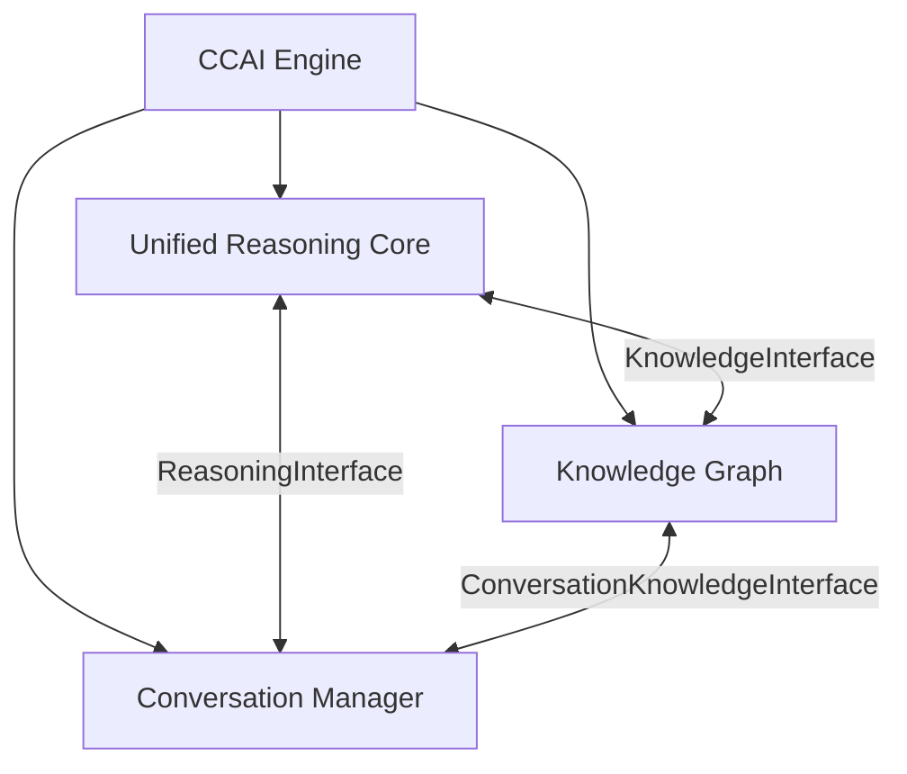
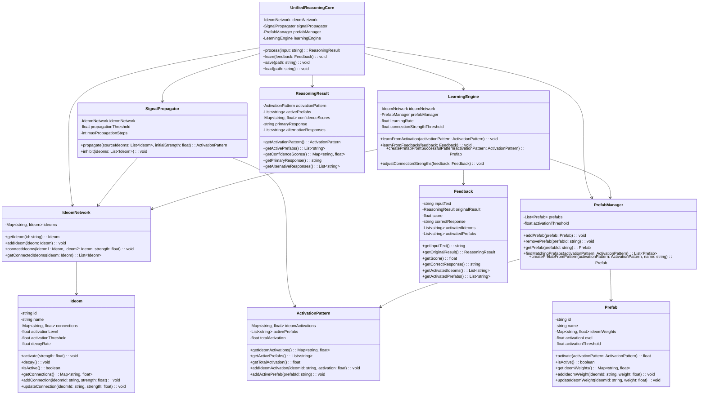
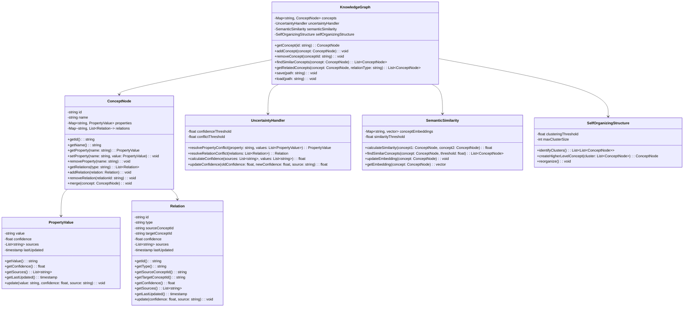

# Technical Specification

This document provides detailed technical specifications for implementing the new CCAI Engine architecture. It includes class diagrams, interface definitions, data structures, algorithms, and implementation details for each component.

## 1. System Architecture

### 1.1 High-Level Architecture

The CCAI Engine consists of three core components:

1. **Unified Reasoning Core**: Responsible for reasoning, learning, and decision-making
2. **Knowledge Graph**: Responsible for storing and retrieving knowledge
3. **Conversation Manager**: Responsible for managing conversations and generating responses

These components interact through well-defined interfaces:

1. **KnowledgeInterface**: Connects the Unified Reasoning Core and Knowledge Graph
2. **ReasoningInterface**: Connects the Unified Reasoning Core and Conversation Manager
3. **ConversationKnowledgeInterface**: Connects the Knowledge Graph and Conversation Manager

The main integration class, `CCAIEngine`, orchestrates the interactions between these components.



### 1.2 Component Interactions

The components interact through the following flow:

1. The `CCAIEngine` receives a message from the user
2. The message is passed to the `ConversationManager` for processing
3. The `ConversationManager` extracts the intent and context
4. The `ConversationManager` requests reasoning from the `UnifiedReasoningCore` through the `ReasoningInterface`
5. The `UnifiedReasoningCore` processes the request, accessing knowledge from the `KnowledgeGraph` through the `KnowledgeInterface` as needed
6. The `UnifiedReasoningCore` returns the reasoning results to the `ConversationManager`
7. The `ConversationManager` generates a response based on the reasoning results
8. The `CCAIEngine` returns the response to the user

## 2. Unified Reasoning Core

### 2.1 Class Diagram



### 2.2 Key Data Structures

#### 2.2.1 Ideom

The `Ideom` class represents an atomic unit of cognition. It has the following properties:

- `id`: A unique identifier for the ideom
- `name`: A human-readable name for the ideom
- `connections`: A map of ideom IDs to connection strengths
- `activationLevel`: The current activation level of the ideom
- `activationThreshold`: The threshold at which the ideom becomes active
- `decayRate`: The rate at which the activation level decays over time

#### 2.2.2 Prefab

The `Prefab` class represents a pattern of ideom activations that corresponds to a higher-level concept or response. It has the following properties:

- `id`: A unique identifier for the prefab
- `name`: A human-readable name for the prefab
- `ideomWeights`: A map of ideom IDs to weights
- `activationLevel`: The current activation level of the prefab
- `activationThreshold`: The threshold at which the prefab becomes active

#### 2.2.3 ActivationPattern

The `ActivationPattern` class represents the current state of activation in the ideom network. It has the following properties:

- `ideomActivations`: A map of ideom IDs to activation levels
- `activePrefabs`: A list of active prefab IDs
- `totalActivation`: The total activation level across all ideoms

#### 2.2.4 ReasoningResult

The `ReasoningResult` class represents the result of a reasoning process. It has the following properties:

- `activationPattern`: The activation pattern that resulted from the reasoning process
- `activePrefabs`: A list of active prefab IDs
- `confidenceScores`: A map of response options to confidence scores
- `primaryResponse`: The primary response
- `alternativeResponses`: A list of alternative responses

#### 2.2.5 Feedback

The `Feedback` class represents feedback on a reasoning result. It has the following properties:

- `inputText`: The original input text
- `originalResult`: The original reasoning result
- `score`: A score indicating the quality of the result
- `correctResponse`: The correct response
- `activatedIdeoms`: A list of ideom IDs that should have been activated
- `activatedPrefabs`: A list of prefab IDs that should have been activated

### 2.3 Key Algorithms

#### 2.3.1 Signal Propagation

The signal propagation algorithm is responsible for propagating activation signals through the ideom network. It works as follows:

1. Start with a set of source ideoms and an initial activation strength
2. Activate the source ideoms with the initial strength
3. For each active ideom:
   a. Get all connected ideoms
   b. For each connected ideom:
      i. Calculate the activation strength based on the connection strength
      ii. If the activation strength is above the propagation threshold, activate the connected ideom
4. Repeat steps 3-4 for a maximum number of propagation steps or until no new ideoms are activated
5. Return the resulting activation pattern

```python
def propagate(source_ideoms, initial_strength):
    activation_pattern = ActivationPattern()
    active_ideoms = set(source_ideoms)
    
    for ideom in source_ideoms:
        ideom.activate(initial_strength)
        activation_pattern.add_ideom_activation(ideom.id, ideom.activation_level)
    
    for step in range(max_propagation_steps):
        new_active_ideoms = set()
        
        for ideom in active_ideoms:
            connections = ideom.get_connections()
            
            for connected_ideom_id, connection_strength in connections.items():
                connected_ideom = ideom_network.get_ideom(connected_ideom_id)
                activation_strength = ideom.activation_level * connection_strength
                
                if activation_strength > propagation_threshold:
                    connected_ideom.activate(activation_strength)
                    activation_pattern.add_ideom_activation(connected_ideom.id, connected_ideom.activation_level)
                    new_active_ideoms.add(connected_ideom)
        
        if not new_active_ideoms:
            break
        
        active_ideoms = new_active_ideoms
    
    return activation_pattern
```

#### 2.3.2 Prefab Activation

The prefab activation algorithm is responsible for identifying which prefabs match the current activation pattern. It works as follows:

1. Start with an activation pattern
2. For each prefab:
   a. Calculate the activation level based on the ideom weights and the activation pattern
   b. If the activation level is above the activation threshold, mark the prefab as active
3. Return the list of active prefabs

```python
def find_matching_prefabs(activation_pattern):
    matching_prefabs = []
    
    for prefab in prefabs:
        activation_level = prefab.activate(activation_pattern)
        
        if prefab.is_active():
            matching_prefabs.append(prefab)
            activation_pattern.add_active_prefab(prefab.id)
    
    return matching_prefabs
```

#### 2.3.3 Learning from Activation

The learning from activation algorithm is responsible for updating connection strengths based on co-activation. It works as follows:

1. Start with an activation pattern
2. For each pair of active ideoms:
   a. Increase the connection strength based on the product of their activation levels
   b. If the connection strength exceeds the connection strength threshold, create a new connection if one doesn't exist
3. For each active prefab:
   a. Increase the weights of active ideoms in the prefab
   b. Decrease the weights of inactive ideoms in the prefab

```python
def learn_from_activation(activation_pattern):
    ideom_activations = activation_pattern.get_ideom_activations()
    active_ideoms = [ideom_network.get_ideom(ideom_id) for ideom_id in ideom_activations.keys()]
    
    for i in range(len(active_ideoms)):
        for j in range(i + 1, len(active_ideoms)):
            ideom1 = active_ideoms[i]
            ideom2 = active_ideoms[j]
            
            activation_product = ideom1.activation_level * ideom2.activation_level
            connection_strength = ideom1.get_connections().get(ideom2.id, 0)
            new_connection_strength = connection_strength + learning_rate * activation_product
            
            if new_connection_strength > connection_strength_threshold:
                ideom1.update_connection(ideom2.id, new_connection_strength)
                ideom2.update_connection(ideom1.id, new_connection_strength)
    
    for prefab_id in activation_pattern.get_active_prefabs():
        prefab = prefab_manager.get_prefab(prefab_id)
        ideom_weights = prefab.get_ideom_weights()
        
        for ideom_id, weight in ideom_weights.items():
            if ideom_id in ideom_activations:
                new_weight = weight + learning_rate * ideom_activations[ideom_id]
                prefab.update_ideom_weight(ideom_id, new_weight)
            else:
                new_weight = weight - learning_rate * 0.1  # Small decay for inactive ideoms
                prefab.update_ideom_weight(ideom_id, max(0, new_weight))
```

#### 2.3.4 Learning from Feedback

The learning from feedback algorithm is responsible for updating connection strengths and prefab weights based on explicit feedback. It works as follows:

1. Start with a feedback object
2. If the feedback score is positive:
   a. Strengthen connections between ideoms that were activated in the original result
   b. Strengthen weights of ideoms in prefabs that were activated in the original result
3. If the feedback score is negative:
   a. Weaken connections between ideoms that were activated in the original result
   b. Weaken weights of ideoms in prefabs that were activated in the original result
4. If a correct response is provided:
   a. Create a new prefab based on the correct response
   b. Strengthen connections between ideoms that should have been activated

```python
def learn_from_feedback(feedback):
    original_activation_pattern = feedback.get_original_result().get_activation_pattern()
    score = feedback.get_score()
    
    if score > 0:
        # Positive feedback - strengthen connections and weights
        learn_from_activation(original_activation_pattern)
    else:
        # Negative feedback - weaken connections and weights
        ideom_activations = original_activation_pattern.get_ideom_activations()
        active_ideoms = [ideom_network.get_ideom(ideom_id) for ideom_id in ideom_activations.keys()]
        
        for i in range(len(active_ideoms)):
            for j in range(i + 1, len(active_ideoms)):
                ideom1 = active_ideoms[i]
                ideom2 = active_ideoms[j]
                
                connection_strength = ideom1.get_connections().get(ideom2.id, 0)
                new_connection_strength = connection_strength - learning_rate * abs(score)
                
                if new_connection_strength > 0:
                    ideom1.update_connection(ideom2.id, new_connection_strength)
                    ideom2.update_connection(ideom1.id, new_connection_strength)
                else:
                    ideom1.remove_connection(ideom2.id)
                    ideom2.remove_connection(ideom1.id)
        
        for prefab_id in original_activation_pattern.get_active_prefabs():
            prefab = prefab_manager.get_prefab(prefab_id)
            ideom_weights = prefab.get_ideom_weights()
            
            for ideom_id, weight in ideom_weights.items():
                if ideom_id in ideom_activations:
                    new_weight = weight - learning_rate * abs(score)
                    prefab.update_ideom_weight(ideom_id, max(0, new_weight))
    
    if feedback.get_correct_response():
        # Create a new prefab based on the correct response
        correct_activation_pattern = create_activation_pattern_from_text(feedback.get_correct_response())
        prefab_manager.create_prefab_from_pattern(correct_activation_pattern, "Learned Prefab")
        
        # Strengthen connections between ideoms that should have been activated
        learn_from_activation(correct_activation_pattern)
```

## 3. Knowledge Graph

### 3.1 Class Diagram



### 3.2 Key Data Structures

#### 3.2.1 ConceptNode

The `ConceptNode` class represents a concept in the knowledge graph. It has the following properties:

- `id`: A unique identifier for the concept
- `name`: A human-readable name for the concept
- `properties`: A map of property names to property values
- `relations`: A map of relation types to lists of relations

#### 3.2.2 PropertyValue

The `PropertyValue` class represents a property value with uncertainty. It has the following properties:

- `value`: The value of the property
- `confidence`: A confidence score for the value
- `sources`: A list of sources that provided the value
- `lastUpdated`: A timestamp indicating when the value was last updated

#### 3.2.3 Relation

The `Relation` class represents a relation between two concepts with uncertainty. It has the following properties:

- `id`: A unique identifier for the relation
- `type`: The type of the relation
- `sourceConceptId`: The ID of the source concept
- `targetConceptId`: The ID of the target concept
- `confidence`: A confidence score for the relation
- `sources`: A list of sources that provided the relation
- `lastUpdated`: A timestamp indicating when the relation was last updated

### 3.3 Key Algorithms

#### 3.3.1 Uncertainty Handling

The uncertainty handling algorithm is responsible for resolving conflicts between different property values or relations. It works as follows:

1. For property conflicts:
   a. Group property values by their actual values
   b. Calculate a combined confidence score for each value based on the sources and individual confidence scores
   c. If one value has a significantly higher confidence score (above the conflict threshold), return that value
   d. Otherwise, return the value with the highest confidence score but with a reduced confidence

2. For relation conflicts:
   a. Group relations by their types and target concepts
   b. Calculate a combined confidence score for each relation based on the sources and individual confidence scores
   c. If one relation has a significantly higher confidence score (above the conflict threshold), return that relation
   d. Otherwise, return the relation with the highest confidence score but with a reduced confidence

```python
def resolve_property_conflict(property_name, values):
    value_groups = {}
    
    for value in values:
        if value.get_value() not in value_groups:
            value_groups[value.get_value()] = []
        
        value_groups[value.get_value()].append(value)
    
    best_value = None
    best_confidence = 0
    
    for value_str, value_list in value_groups.items():
        combined_confidence = calculate_confidence([v.get_sources() for v in value_list], [v.get_value() for v in value_list])
        
        if combined_confidence > best_confidence:
            best_confidence = combined_confidence
            
            # Create a new PropertyValue with the combined confidence
            best_value = PropertyValue(value_str, combined_confidence, [s for v in value_list for s in v.get_sources()])
    
    # Check if there's a clear winner
    second_best_confidence = max([calculate_confidence([v.get_sources() for v in value_groups[vs]], [v.get_value() for v in value_groups[vs]]) for vs in value_groups if vs != best_value.get_value()], default=0)
    
    if best_confidence - second_best_confidence < conflict_threshold:
        # No clear winner, reduce confidence
        best_value.update(best_value.get_value(), best_confidence * 0.8, "conflict_resolution")
    
    return best_value
```

#### 3.3.2 Semantic Similarity

The semantic similarity algorithm is responsible for calculating the similarity between concepts and finding similar concepts. It works as follows:

1. For calculating similarity:
   a. Get the embeddings for both concepts
   b. Calculate the cosine similarity between the embeddings
   c. Return the similarity score

2. For finding similar concepts:
   a. Calculate the similarity between the input concept and all other concepts
   b. Return the concepts with similarity scores above the threshold

```python
def calculate_similarity(concept1, concept2):
    embedding1 = get_embedding(concept1)
    embedding2 = get_embedding(concept2)
    
    # Calculate cosine similarity
    dot_product = sum(a * b for a, b in zip(embedding1, embedding2))
    magnitude1 = math.sqrt(sum(a * a for a in embedding1))
    magnitude2 = math.sqrt(sum(b * b for b in embedding2))
    
    if magnitude1 * magnitude2 == 0:
        return 0
    
    return dot_product / (magnitude1 * magnitude2)

def find_similar_concepts(concept, threshold):
    similar_concepts = []
    
    for other_concept in concepts.values():
        if other_concept.get_id() == concept.get_id():
            continue
        
        similarity = calculate_similarity(concept, other_concept)
        
        if similarity >= threshold:
            similar_concepts.append((other_concept, similarity))
    
    # Sort by similarity in descending order
    similar_concepts.sort(key=lambda x: x[1], reverse=True)
    
    return [c for c, s in similar_concepts]
```

#### 3.3.3 Self-Organizing Structure

The self-organizing structure algorithm is responsible for identifying clusters of related concepts and creating higher-level concepts. It works as follows:

1. For identifying clusters:
   a. Start with each concept in its own cluster
   b. Calculate the similarity between all pairs of clusters
   c. Merge the most similar pair of clusters if their similarity is above the clustering threshold
   d. Repeat until no more clusters can be merged or the maximum cluster size is reached

2. For creating higher-level concepts:
   a. Identify the common properties and relations across all concepts in the cluster
   b. Create a new concept with these common properties and relations
   c. Add relations from the new concept to all concepts in the cluster

```python
def identify_clusters():
    # Start with each concept in its own cluster
    clusters = [[concept] for concept in concepts.values()]
    
    while True:
        best_merge = None
        best_similarity = 0
        
        for i in range(len(clusters)):
            for j in range(i + 1, len(clusters)):
                cluster1 = clusters[i]
                cluster2 = clusters[j]
                
                # Skip if merging would exceed the maximum cluster size
                if len(cluster1) + len(cluster2) > max_cluster_size:
                    continue
                
                # Calculate the average similarity between all pairs of concepts in the two clusters
                total_similarity = 0
                pair_count = 0
                
                for concept1 in cluster1:
                    for concept2 in cluster2:
                        similarity = calculate_similarity(concept1, concept2)
                        total_similarity += similarity
                        pair_count += 1
                
                average_similarity = total_similarity / pair_count if pair_count > 0 else 0
                
                if average_similarity > best_similarity and average_similarity >= clustering_threshold:
                    best_similarity = average_similarity
                    best_merge = (i, j)
        
        if best_merge is None:
            break
        
        # Merge the clusters
        i, j = best_merge
        clusters[i].extend(clusters[j])
        clusters.pop(j)
    
    return clusters

def create_higher_level_concept(cluster):
    # Identify common properties
    common_properties = {}
    
    for property_name in set(p for concept in cluster for p in concept.get_properties().keys()):
        property_values = [concept.get_property(property_name) for concept in cluster if concept.has_property(property_name)]
        
        if len(property_values) == len(cluster):
            # All concepts have this property
            common_properties[property_name] = resolve_property_conflict(property_name, property_values)
    
    # Identify common relations
    common_relations = {}
    
    for relation_type in set(r.get_type() for concept in cluster for r in concept.get_all_relations()):
        relation_groups = {}
        
        for concept in cluster:
            for relation in concept.get_relations(relation_type):
                target_id = relation.get_target_concept_id()
                
                if target_id not in relation_groups:
                    relation_groups[target_id] = []
                
                relation_groups[target_id].append(relation)
        
        for target_id, relations in relation_groups.items():
            if len(relations) == len(cluster):
                # All concepts have a relation of this type to this target
                if relation_type not in common_relations:
                    common_relations[relation_type] = []
                
                common_relations[relation_type].append(resolve_relation_conflict(relations))
    
    # Create the new concept
    higher_level_concept = ConceptNode(generate_id(), "Cluster_" + str(uuid.uuid4()))
    
    for property_name, property_value in common_properties.items():
        higher_level_concept.set_property(property_name, property_value)
    
    for relation_type, relations in common_relations.items():
        for relation in relations:
            higher_level_concept.add_relation(relation)
    
    # Add relations to the cluster members
    for concept in cluster:
        relation = Relation(generate_id(), "has_member", higher_level_concept.get_id(), concept.get_id(), 1.0, ["clustering"])
        higher_level_concept.add_relation(relation)
    
    return higher_level_concept
```

## 4. Conversation Manager

### 4.1 Class Diagram

```mermaid
classDiagram
    class ConversationManager {
        -ConversationContext context
        -IntentRecognizer intentRecognizer
        -ResponsePlanner responsePlanner
        -MemoryManager memoryManager
        +processMessage(message: string): string
        +updateContext(message: string, response: string): void
        +save(path: string): void
        +load(path: string): void
    }
    
    class ConversationContext {
        -string conversationId
        -List~Message~ messages
        